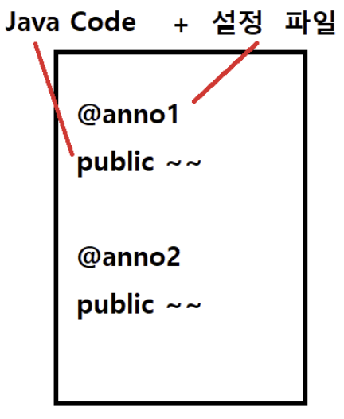
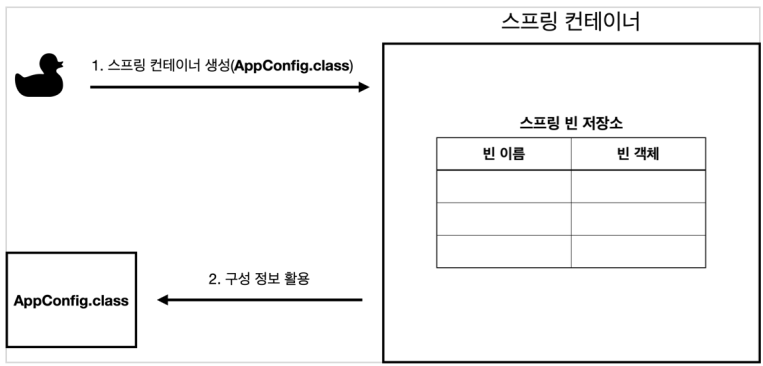
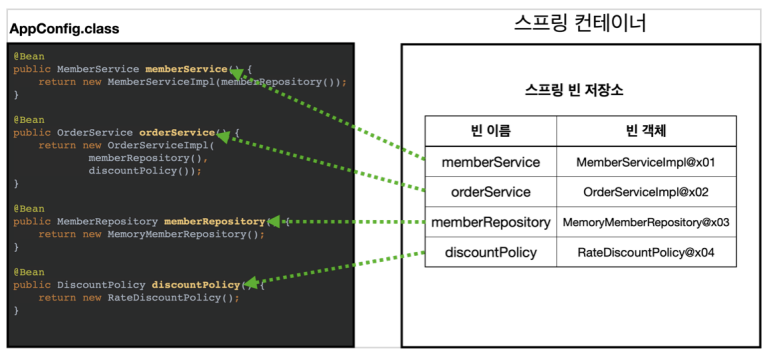
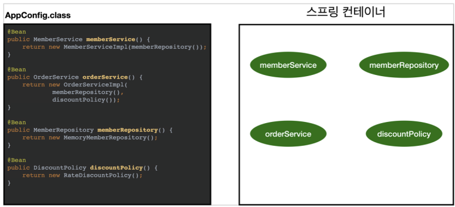

# spring-tutorial-18th
CEOS 18th Backend Study - Spring Tutorial


## 스프링의 3대 요소(Spring Triangle)
### IoC/DI
***
* IoC - Inversion of Control : 제어의 역전
* DI - Dependency Injection : 의존성 주입
- **메소드나 객체의 호출작업을 개발자가 결정하는 것이 아니라, 외부에서 결정되는 것을 의미**
- 객체의 의존성을 역전시켜 객체 간의 결합도를 줄이고 유연한 코드 작성 가능

  → 가독성 및 코드 중복, 유지 보수 용이
- 객체의 생성 및 실행 과정을 [객체 생성 -> 의존성 객체 생성/주입 -> 의존성 객체 메소드 호출] 의 순서로 본다면   
기존에는 클래스 내부에서 의존성 객체를 생성했지만   
스프링에서는 의존성 객체를 생성하는 것이 아니라 주입한다   
스스로 만드는 것이 아니라 제어권을 스프링에게 위임하여 스프링이 만들어놓은 객체를 주입한다는 뜻
- 스프링이 모든 의존성 객체를 스프링이 실행될 때 다 만들어주고 필요한 곳에 주입해주기 때문에 Bean들은 싱글턴 패턴의 특징을 가지고   
제어의 흐름을 사용자가 컨트롤 하는 것이 아니라 스프링에게 맡겨 작업을 처리하게 된다 

<br/>

### AOP
***
* AOP - Aspect Oriented Programming : 관점 지향 프로그래밍
* 어떤 로직을 핵심적인 관점(비즈니스 로직)과 부가적인 관점(데이터베이스 연결, 로깅, 파일 입출력)으로 나누어서 보고   
그 관점을 기준으로 각각 모듈화
* AOP에서 로직을 모듈화한다는 것은 코드를 부분적으로 나누어 모듈화하겠다는 의미하고   
  이때, 소스 코드 상에서 다른 부분에 계속 반복해서 쓰는 코드들을 발견할 수 있는데   
  이것을 흩어진 관심사 (Crosscutting Concerns)라고 한다 → 공통 관심 사항
- 이 흩어진 관심사를 Aspect로 모듈화하고 핵심적인 비즈니스 로직에서 분리하여 재사용하겠다는 것이 AOP의 취지
* AOP가 필요한 상황 : 모든 메소드의 호출 시간을 측정하고 싶다면?
    * 천 개가 넘는 메소드에 다 들어가서 시작과 끝에 호출 시간 남기기   
각 메소드 시작과 끝에 시간 측정 로직 집어넣기  
호출 시간 초단위로 계산했는데 ms로 바꾸라고 하면 또 각각 다 수정해야 한다 
    * 공통 관심 사항(cross-cutting concern) vs 핵심 관심 사항(core concern) 구분
  ```java
    public Long join(Member member) { //회원가입
        long start = System.currentTimeMillis();
  
        try {
            validateDuplicateember(member); //중복회원 검증
            memberRepository.save(member);
            return member.getId();
        } finally {
            long finish = System.currentTimeMillis();
            long timeMs = finish - start;
            System.out.println("join = " + timeMs + "ms");
        }
    }
  ```
    * 위 코드의 문제점 
      * 회원가입, 회원 조회에 시간을 측정하는 기능은 **핵심 관심 사항**이 아니다
      - try문 안의 기능은 핵심 비즈니스 로직이지만 시간을 측정하는 로직은 핵심이 아니다
      - 시간을 측정하는 로직은 **공통 관심 사항**이다
      - 시간을 측정하는 로직과 핵심 비즈니스의 로직이 섞여서 유지보수가 어렵다
      - 시간을 측정하는 로직을 별도의 공통 로직으로 만들기 매우 어렵다
      - 시간을 측정하는 로직을 변경할 때 모든 로직을 찾아가면서 변경해야 한다
    
    ```java
    @Aspect
    @Component
    public class TimeTraceAop {
        @Around("execution(* hello.hellospring..*(..))")
        public Object execute(ProceedingJoinPoint joinPoint) throws Throwable {
            long start = System.currentTimeMillis();
            ystem.out.println("START : " + joinPoint.toString());
            try {
            return joinPoint.proceed();
            } finally {
            long finish = System.currentTimeMillis();
            long timeMs = finish - start;
            System.out.println("END : " + joinPoint.toString() + " " + timeMs + "ms");
            }
        }
    }
    ```
    * 위 코드 설명
      * **@Aspect** 어노테이션 사용해야 AOP로 사용 가능
      * **@Component** 스프링빈으로 등록 (@Component 쓰기도 하는데 스프링빈에 직접 등록 더 선호)
      * **@Around**로 이 공통 관심 사항을 어디에 적용할 지 설정, 타겟팅  
  실행하는 패키지명, 밑에 하위 전체로 설정, 타겟은 따로 다 설정할 수 있음
      * **joinPoint**  
  argument 뭔지, 어느 타겟에서 호출하는지, 지금 내가 누군지 등 여러 메소드   
    호출이 될 때마다 중간에서 인터셉트가 걸리는 것  
  필요하면 중간에 어떤 조건이면 넘어가지마 라는 설정도 가능   
  이렇게 중간에 인터셉트해서 사용할 수 있는 기술이 AOP

  * 해결
    * 회원가입, 회원 조회 등 핵심 관심사항과 시간을 측정하는 공통 관심 사항 분리
    - 시간을 측정하는 로직을 별도의 공통 로직으로 만들었다
    - 핵심 관심 사항을 깔끔하게 유지할 수 있다
    - 변경이 필요하면 이 로직만 변경하면 된다
    - 원하는 적용 대상을 선택할 수 있다

### PSA   
***
* PSA - Portable Service Abstraction : 추상화 서비스
*  ex. @Transactional 어노테이션을 선언하는 것 만으로 별도의 코드 추가 없이 트랜잭션 서비스를 사용할 수 있다
*  내부적으로 트랜잭션 코드가 추상화되어 숨겨져 있기 때문이고   
   이렇게 추상화 계층을 사용하여 어떤 기술을 내부에 숨기고 개발자에게 편의성을 제공해주는 것을 서비스 추상화(Service Abstraction) 라고 한다
* JDBC, JPA 둘 중 어떤 방법을 사용하더라도 DB에 접근할 수 있고, @Transactional 어노테이션을 이용해 트랜잭션을 유지하는 기능을 추가할 수 있다   
-> 이렇게 하나의 추상화로 여러 서비스를 묶어둔 것을 Spring에서 Portable Service Abstraction 이라고 한다 
* Spring Web MVC   
@Controller를 통해 요청을 매핑할 수 있는 컨트롤러 역할을 수행하는 클래스가 된다
* Spring Transaction   
@Transaction을 이용해 단순히 메소드에 어노테이션을 붙여줌으로써 트랜잭션 처리가 이루어진다
* Spring Cache   
@Cacheable 어노테이션을 붙여줌으로써 구현체를 크게 신경쓰지 않아도 필요에 따라 바꿔 쓸 수 있다 


## 스프링 어노테이션 @

### 어노테이션이란 무엇이며, Java에서 어떻게 구현될까요?

---



- 자바 소스 코드에 추가할 수 있는 일종의 메타데이터
- 자체적으로 프로젝트에는 영향을 미치지 않음
- 클래스, 인터페이스, 메소드, 변수 , 파라미터 등에 사용된다

#### 🔍어노테이션을 사용하는 이유

1. **`빠르고 효율적이다`**

   Annotation Processor는 자바 컴파일러 javac의 일부로, 모든 처리를 컴파일 타임에 하게 된다
   런타임의 부담을 줄여 빠른 처리가 가능하다

2. **`리플렉션(Reflection)`** 이 발생하지 않음
    - 리플렉션이란?
        - 구체적인 클래스 타입을 알지 못하더라도 그 내부에 있는 메소드, 타입, 변수를 접근하게 해주는 자바 API
        - 컴파일 시간이 아닌 실행 시간에 동적으로 클래스의 정보를 추출할 수 있는 프로그래밍 기법
          → 즉, 동적으로 클래스를 사용해야할 때 사용하고
          작성 시점에는 어떤 클래스를 사용해야 할 지 모르지만 런타임 시점에 가져와 실행해야 하는 경우 필요하다
        > 런타임 시에 클래스의 메타 정보를 얻는 기능을 말한다. 예를 들어 클래스가 가지고 있는 필드가 무엇인지, 어떤 생성자를 가지고 있는지, 어떤 메소드를 가지고 있는지, 적용된 어노테이션이 무엇인지를 알아내는 것이 리플렉션이다.
        > 
3. **`보일러 플레이트`** 제거

   > 비슷한 형태로 반복되는 코드

#### 어노테이션 종류

1. **Built-in Annotation 표준/내장 어노테이션**
    - **`@Override`**

      메소드 앞에 사용 현재 메소드가 수퍼클래스의 메소드를 재정의 했음을 컴파일러에게 명시하고, 재정의 시 오탈자를 막아주는 역할도

    - **`@Deprecated`**

      차후 버전에서 지원 중단 예정 등의 이유로 앞으로 사용하지 않을 것을 권장하는 필드나 메서드에 사용

      > 없애지 않는 이유는?
      >
      >
      > 이전에 해당 메소드로 개발을 진행한 프로젝트들이 있기 때문에 유지는 하되, 권장하지 않는 방향으로
    
    - **`@SupressWarning`**

      컴파일러의 경고메세지가 나타나지 않게 한다
      컴파일러가 주는 경고 메세지를 프로그래머가 의도적으로 무시하고자 할 때 사용

    - **`@FunctionalInterace`**

      `@Override`와 유사한 기능으로, 컴파일러에게 함수형 인터페이스라는 것을 알려 올바르게 작성했는지 체크하고 입력 실수 방지

    - **`@NonNull`**

      파라미터로 Null을 넣지 못하게 경고하는 의미에서 사용되는 어노테이션
      인자로 null을 넣으면 컴파일러가 경고를 표시한다

2. **Meta Annotation** **메타 어노테이션**
    - 어노테이션을 위한 어노테이션
    - 해당 어노테이션의 동작 대상, 스코프를 결정하고, 주로 새로운 어노테이션을 정의할 때 사용
    - **`@Target`**

      어노테이션을 정의할 때, 해당 어노테이션의 적용 대상을 지정하는 데 사용하고
      여러 대상을 지정해야 할 때는 `{중괄호}`로 묶어서 사용한다

      value에는 ElementType이라는 Enum객체를 사용한다

        ```java
        ElementType.PACKAGE : 패키지 선언
        ElementType.TYPE : 타입 선언
        ElementType.ANNOTATION_TYPE : 어노테이션 타입 선언
        ElementType.CONSTRUCTOR : 생성자 선언
        ElementType.FIELD : 멤버 변수 선언
        ElementType.LOCAL_VARIABLE : 지역 변수 선언
        ElementType.METHOD : 메서드 선언
        ElementType.PARAMETER : 전달인자 선언
        ElementType.TYPE_PARAMETER : 전달인자 타입 선언
        ElementType.TYPE_USE : 타입 선언
        ```

    - **`@Retention`**

      어노테이션의 유지기간(라이프사이클)을 지정하는 데 사용하고, 세 가지 규칙

        - **`RetentionPolicy.RUNTIME`**

          컴파일 이후에도 JVM에 의해 계속 참조가 가능하고 주로 리플렉션이나 로깅에 많이 사용됩니다.

        - **`RetentionPolicy.CLASS`**

          컴파일러가 클래스를 참조할 때가지 유효

        - **`RetentionPolicy.SOURCE`**

          컴파일 전까지만 유효 → 컴파일 이후에는 사라짐

    ```java
    @Target(ElementType.METHOD)
        @Retention(RetentionPolicy.SOURCE)
    public @interface MyAnnotation{}
    ```
    
    - **`@Documented`**
        
        어노테이션에 대한 정보가 javadoc으로 작성한 문서에 포함되도록 할 때 사용하는 어노테이션
        
        Built-in 표준/내장 Annotation 중 `@Override`와 `@SuppressWarnings`를 제외하고는 모두 이 어노테이션이 붙어있다
        
    - **`@Inherited`**
        
        어노테이션도 상속이 가능하다! 어노테이션을 자손 클래스에 상속하고자 할 때 사용
        
    - **`@Native`**
        
        네이티브 메소드에 의해 참조되는 상수 필드에 붙이는 어노테이션
        
        > 네이티브 메소드란?  
         JVM이 설치 된 OS의 메소드로
         자바에서는 메서드의 선언부만 정의하고, 실질적인 구현은 C언어나 C++로 되어있다
    네이티브 메소드와 자바에서 정의한 메소드를 연결하는 것을 JNI(Java Native Interface)라고 한다 
        > 
    - **`@Repeatable`**
        
        반복해서 붙일 수 있는 어노테이션을 정의할 때 사용 

3. **Custom Annotation 사용자 정의 어노테이션**
    - `**@interface**`

      어노테이션은 특별한 종류의 인터페이스이고, 일반 인터페이스와의 구분을 위해 @interface로 선언 
        
    - Annotation은 모든 어노테이션의 조상이지만 상속은 불가능하다
    ```java
    public interface Annotation{
        boolean equals(Object obj);
        int hashCode();
        String toString();
        Class<? extends Annotation> annotationType();
    }
     ```

    - 어노테이션은 메타데이터의 저장을 위한 Element를 가질 수 있고, 요소의 개수에 따라 세 가지로 구분할 수 있다
        - **`Marker Annotation`**

          Element가 하나도 없는, 단순 표식으로 사용되는 어노테이션, 컴파일러에게 의미를 전달하거나 주석 목적으로 사용

          `@Test` : 테스트 프로그램에게 테스트 대상임을 알리는 어노테이션

        - **`Single-value Annotation`**

          Element가 한 개인 어노테이션으로, 값을 명시해 데이터를 전달하기 위해 사용

        - **`Full Annotation`** 또는 **`Multi-value Annotation`**

          Element로 둘 이상의 변수를 갖는 어노테이션으로, 데이터를 배열 안에 `key-value` 형태로 전달한다

          Element의 타입은 기본형, String, enum, Annotation, Class만 허용


### 스프링에서 어노테이션을 통해 Bean을 등록할 때, 어떤 일련의 과정이 일어나는지 탐구해보세요.

---

```java
@Configuration
public class AppConfig {
    @Bean
    public MemberRepository memberRepository(){
        return new MemoryMemberRepository();
    }
} 
```

- `@Configuration` 구성 정보에 `@Bean` 어노테이션을 통해 스프링 컨테이너에 직접 빈으로 등록할 수 있다
- 빈 객체로 등록하고 싶은 메서드의 위에 `@Bean` 어노테이션 추가하기
- 스프링 컨테이너에 <key(빈 이름), value(빈 객체)> 쌍으로 저장하는데

  key(빈 이름)에는 메서드의 이름(memberRepository), value(빈 객체)에는 실제 반환하는 객체를 담아 스프링 컨테이너에 저장한다

1. 스프링 컨테이너 생성

   

    - AppConfig의 정보를 주면서 컨테이너 생성
    - 스프링 컨테이너 안에는 스프링 빈 저장소가 있는데

      key에는 빈 이름, 값 value에는 빈 객체 저장

    - 스프링 빈 저장소 구성 정보를 AppConfig.class로 지정한 것
2. 스프링 빈 등록

   

    - 스프링 컨테이너는 파라미터로 넘어온 설정 클래스 정보를 사용해서 스프링 빈 등록
    - 빈 이름은 기본적으로 메소드 이름을 사용하지만 `@Bean(name="memberService2")`와 같이 지정도 가능하다
    - 빈 이름은 항상 다른 이름을 부여해야 한다

      같은 이름을 부여하면,
      다른 빈이 무시되거나, 기존 빈을 덮어버리거나 설정에 따라 오류가 발생한다

3. 스프링 빈 의존관계 설정 - 준비

   

4. 스프링 빈 의존관계 설정 - 완료

   

    - 스프링 컨테이너는 설정 정보를 참고해서 의존관계를 주입(DI)한다
    - 스프링은 스프링 빈 객체를 먼저 생성하고, 그 다음에 의존관계 주입
      → 단계가 나누어져 있다
    - 그런데 이렇게 자바 코드로 스프링 빈을 등록하면 생성자를 호출하면서 의존관계 주입도 한 번에 처리된다. 여기서는 이해를 돕기 위해 개념적으로 나누어 설명

단순히 자바 코드를 호출하는 것 같지만, 차이가 있다

#### @Configuration과 싱글톤

- ex. 클라이언트A가 memberService 요청하면 AppConfig에서 new로 생성해서 반환
  클라이언트B와 C가 요청해도 new로 생성해서 반환
  → 고객이 세 번 요청하면 객체 세 개가 생성된다
    - 스프링 없는 순수한 DI 컨테이너인 AppConfig는 요청을 할 때 마다 객체를 새로 생성
    - 고객 트래픽이 초당 100이 나오면 초당 100개 객체가 생성되고 소멸
      → 메모리 낭비가 심하다.
- 해결방안 : **해당 객체가 딱 1개만 생성되고, 공유하도록 설계**하면 된다 → **싱글톤 패턴**

  > 클래스의 인스턴스가 딱 1개만 생성되는 것을 보장하는 디자인 패턴  
  > → **private 생성자**를 사용해 외부에서 임의로 new 키워드를 사용하지 못하도록 막아야 한다

- **싱글톤 컨테이너**
    - 스프링 컨테이너가 기본적으로 객체를 다 싱글톤으로 만들고 관리해준다
    - 싱글톤 패턴의 문제점을 해결하면서, 객체 인스턴스를 싱글톤(1개만 생성)으로 관리
    - 스프링 컨테이너는 싱글톤 컨테이너 역할을 하고

      이렇게 싱글톤 객체를 생성하고 관리하는 기능을 **싱글톤 레지스트리**라고 한다

    - 스프링 컨테이너의 이런 기능 덕분에 싱글턴 패턴의 모든 단점을 해결하면서
      객체를 싱글톤으로 유지할 수 있다
    - [장점] 싱글톤 패턴을 위한 지저분한 코드가 들어가지 않아도 되고
      DIP, OCP, 테스트, private 생성자로부터 자유롭게 싱글톤을 사용할 수 있다
    - 스프링 컨테이너 덕분에 고객의 요청이 올 때 마다 객체를 생성하는 것이 아니라,
      **이미 만들어진 객체를 공유해서 효율적으로 재사용**할 수 있다
- 스프링 컨테이너는 싱글톤 레지스트리라서 스프링 빈이 싱글톤이 되도록 보장해주어야 한다
    - 자바 코드를 바꿀 수 는 없어서 → **클래스의 바이트코드를 조작**하는 라이브러리(CGLIB) 사용
    - `@Bean`이 붙은 메소드마다 이미 스프링 빈이 존재하면 존재하는 빈을 반환하고,
      스프링 빈이 없으면 생성해서 스프링 빈으로 등록하고 반환하는 코드가 동적으로 만들어진다 → 싱글톤 보장

### `@ComponentScan` 과 같은 어노테이션을 사용하여 스프링이 컴포넌트를 어떻게 탐색하고 찾는지의 과정을 깊게 파헤쳐보세요.

---

- **`@ComponentScan`**

  `@Component` 어노테이션이 붙은 클래스를 찾아 자동으로 스프링 빈 등록

- 스프링은 설정 정보가 없어도 자동으로 스프링 빈을 등록하는 **컴포넌트 스캔**이라는 기능 제공
  컴포넌트 스캔은 기본적으로 `@Component` 어노테이션을 빈 등록 대상으로 포함하는데,
  `@Controller`, `@Service`, `@Component`, `@Repository` 등의 어노테이션은 `@Component` 어노테이션을 포함하고 있다
- 필터

    ```java
    @Configuration
    @ComponentScan(
            includeFilters = @ComponentScan.Filter(type = FilterType.ANNOTATION, classes = MyIncludeComponent.class),
            excludeFilters = @ComponentScan.Filter(type = FilterType.ANNOTATION, classes = MyExcludeComponent.class)
    )
    //필터타입이 @이면 @과 관련된 필터 만드는 거
    static class ComponentFilterAppConfig { }
    ```

    - **includeFilters** : 컴포넌트 스캔 대상 추가로 지정
    - **excludeFilters** : 컴포넌트 스캔에서 제외할 대상 지정
- 동작과정
    1. ConfigurationClassParser 가 Configuration 클래스를 파싱한다

       @Configuration 어노테이션 클래스 파싱

    2. ComponentScan 설정을 파싱한다

       base-package 에 설정한 패키지를 기준으로
       ComponentScanAnnotationParser가 스캔하기 위한 설정을 파싱

       > **[basePackages 탐색범위]**  
        `@ComponentScan`에서 basePackages 속성으로 탐색할 패키지의 시작 위치 지정 가능  
        라이브러리 포함 모든 자바 코드를 뒤지기에는 너무 오래걸린다  
        여러 시작 위치를 지정할 수도 있다  
        **basePackageClasses** : 지정한 클래스의 패키지를 탐색 시작 위치로 지정   
        따로 지정하지 않으면 `@ComponentScan`이 붙은 설정 정보 클래스의 패키지가 시작 위치   
       > - 패키지 위치를 지정하지 않고 설정 정보 클래스의 위치를 프로젝트 최상단에 두기  
    3. base-package 설정을 바탕으로 모든 클래스를 로딩한다
    4. ClassLoader가 로딩한 클래스들을 BeanDefinition으로 정의한다
       생성할 빈의 대한 정의
    5. 생성할 빈에 대한 정의를 토대로 빈 생성